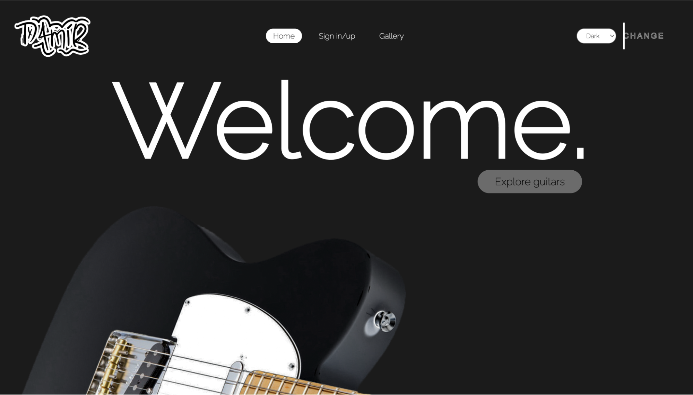
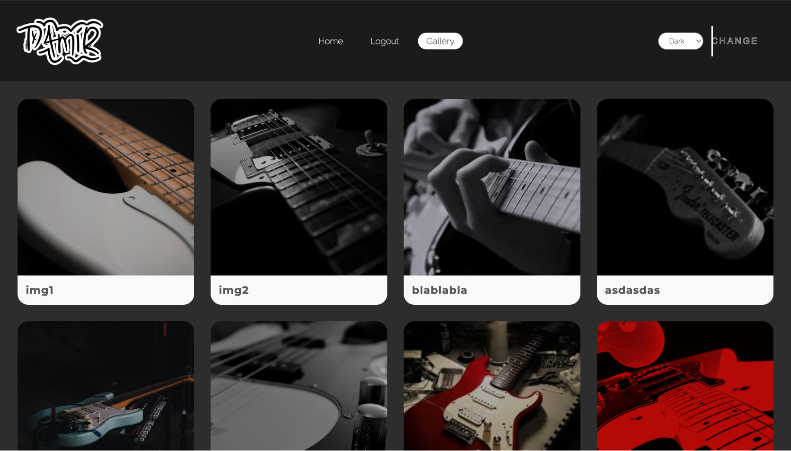

# Guitars gallery/showcase site
### A website for placing products and inspecting them. Backend was written in php and javascript, while frontend functions in css3. All languages were used purely wihtout any frameworks, libraries and dependencies.

# Description of website functionality

### *Main homepage*
**This PHP script is designed to allow users to switch between different themes on a website. The script includes several key features:
Theme Selection: The script starts by setting a default theme of "dark" and checks if a theme cookie or theme query string parameter is set. If either is set, it updates the theme value.
Theme Cookie: If a theme parameter is set, it sets a cookie that expires in 30 days using the setcookie() function. This ensures that the user's selected theme is remembered even after they leave the website.
Outputting the Theme CSS: The script then outputs the appropriate theme CSS file based on the selected theme. If the theme is set to 'light', it outputs the 'css/whiteind.css' file, otherwise it outputs the 'css/ind.css' file.
Session Management: The script also has code for a session that checks if the user is logged in and displays different options in the navigation bar accordingly.
Form for Theme Selection: The script also includes a form for selecting and changing the theme, which allows users to switch between the available themes.
Parallax and static guitar : The script also has sections for displaying text and a button for exploring guitars.**

---

### *Login page*
**This PHP script is designed to handle user login functionality on a website. The script includes several key features:
Session Management: The script starts by calling the session_start() function, which begins a new session or resumes an existing one. This allows the script to maintain information about a user's session, such as whether they are logged in or not.
Login Form: The script includes a login form which allows users to submit their credentials, a username and a password
Data storage: The script reads the contents of a JSON file into a string and convert the JSON string into a PHP object.
Input Sanitization: The script sanitizes the submitted username and password to protect against malicious input.
Password Hashing: The script uses the password_verify() function to check if the submitted password matches the hashed password in the file after concatenating it with the salt.
Session Variable: If the login credentials are valid, the script sets a session variable to indicate that the user is logged in.
Error Handling: If the login credentials are invalid, the script sets an error message.
Redirection: If the login is successful, it redirects the user to the "pho.php" page.**

---

### *Registration page*
**This PHP script is designed to handle user registration functionality on a website. The script includes several key features:
Form validation: The script includes a library for form validation and uses several functions to check for valid input for the name, email, password, and date of birth fields. It also checks if the passwords match.
Input Sanitization: The script sanitizes the input from the form fields to protect against malicious input.
Data storage: The script reads the contents of a JSON file into a string and convert the JSON string into a PHP object.
Salt and Hashed password: The script creates a salt and hashed password for the user using the password_hash() function.
New user array: The script creates a new user array with the input data and a unique id.
JSON Data: The script appends the new user data to the existing JSON data and rewrites the file.
Redirection: If the registration is successful, it redirects the user to the login page.
Error handling: The script also includes error handling for when the validation or other checks fail.**

---

### *Gallery page*
**This code is for a web page that displays a gallery of images that have been uploaded by users. The page is also able to change the theme of the page by either selecting a theme from a dropdown menu or by passing a theme parameter in the query string. The theme is stored in a cookie so that the user's preference is remembered across multiple pages. The page also checks if a user is logged in and displays different navigation options depending on if the user is logged in or not. The page also includes a form that allows users to upload an image and add a caption to it. The uploaded image and caption are stored in a JSON file called "images.json" and are displayed in the gallery.**

---

### *Redirect page*
**This code is a simple HTML document that redirects the user to the login page if they are not logged in.**

# Project contains:
### css folder is used for placing css files in it

### js - folder with javascript files in it:
    check.js - This code is used to check if the name entered by a user in the "name" input field already exists in a JSON data file.

    fen.js - This code is used to create a scrolling effect on a webpage. It uses JavaScript to manipulate the position of two elements on the page, "text" and "btn", as the user scrolls.

    validace.js - This code creates a JavaScript function to validate user input on a registration form. The form has four fields: name, email, password, and password confirmation.

### json - folder with javascript files in it:
    data.json - This file is used to save user registered data.

    images.json - This file is used to save submitted images and text linked to it.

### lib - folder with php validation file in it:
    validate.php - This code validates users input data

### php - folder with php files in it:
    index.php - This is a PHP script that controls the theme of a website.

    login.php - This code is a login page for a website. 
    
    logout.php - This script starts a session, unsets all session variables, destroys the session and redirects the user to the index page. This is typically used to log the user out of the application by removing their session and returning them to the login page.
    
    pho.php - This code displays a gallery of images

    rpa.php - This PHP script is a registration form that allows users to create new accounts on a website. 
    
    treb.php - This code is an HTML file that displays a message telling the user that they must be logged in before they can access the gallery.
    
    upload.php - This script is a PHP script that handles image uploads.

